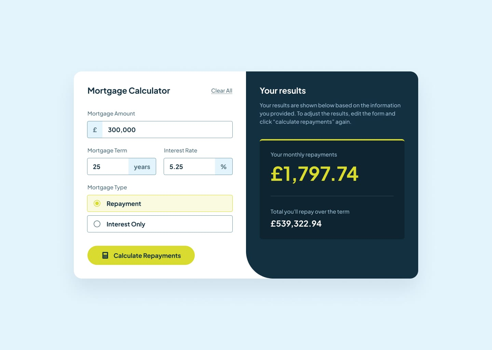
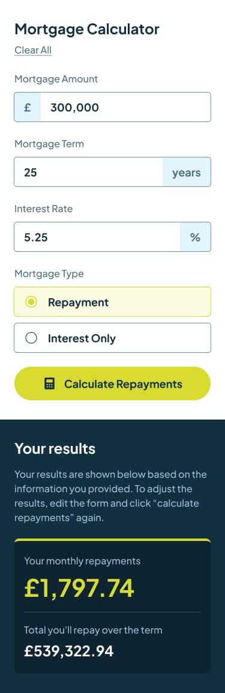

# Frontend Mentor - Mortgage repayment calculator solution

This is a solution to the [Mortgage repayment calculator challenge on Frontend Mentor](https://www.frontendmentor.io/challenges/mortgage-repayment-calculator-Galx1LXK73). Frontend Mentor challenges help you improve your coding skills by building realistic projects. 

## Table of contents

- [Overview](#overview)
  - [The challenge](#the-challenge)
  - [Screenshot](#screenshot)
  - [Links](#links)
- [My process](#my-process)
  - [Built with](#built-with)
  - [Project structure](#project-structure)
  - [What I learned](#what-i-learned)
  - [Continued development](#continued-development)
- [Author](#author)

## Overview

### The challenge

Users should be able to:

- Input mortgage information and see monthly repayment and total repayment amounts after submitting the form
- See form validation messages if any field is incomplete
- Complete the form only using their keyboard
- View the optimal layout for the interface depending on their device's screen size
- See hover and focus states for all interactive elements on the page

### Screenshot

|  |  |
| :--: | :--: |
| Desktop | Mobile |

### Links

- Solution URL: [Add solution URL here](https://your-solution-url.com)
- Live Site URL: [Add live site URL here](https://your-live-site-url.com)

## My process

### Built with

- Semantic HTML5 markup
- CSS custom properties (design tokens)
- CSS Flexbox
- Mobile-first responsive workflow
- Vanilla JavaScript for form validation and calculations

### Project structure

```
index.html          → Main structure, form and results container
index.css           → Styling including responsive layout and states
script.js           → Mortgage calculation logic, validation, and dynamic UI updates
```

### What I learned

During this project, I focused on several key areas:

- **Complex Financial Calculations:** Implemented the standard mortgage repayment formula using JavaScript's `Math.pow()` to calculate compound interest for standard repayments, as well as simple interest logic for interest-only mortgages.

```js
monthlyPayment = principal * (monthlyRate * Math.pow(1 + monthlyRate, totalMonths)) / (Math.pow(1 + monthlyRate, totalMonths) - 1);
```

- **Number Formatting:** Learned how to cleanly format user input to include commas for thousands (as they type) and how to output formatted GBP currency values using the native `Intl.NumberFormat` API.

```js
const formatCurrency = (value) => {
  return new Intl.NumberFormat('en-GB', {
    style: 'currency',
    currency: 'GBP',
    minimumFractionDigits: 2,
    maximumFractionDigits: 2
  }).format(value);
};
```

- **Custom Form Controls:** Created custom radio buttons using CSS to perfectly match the design, hiding the default input and styling a custom pseudo-element (`::after`) for the selected state.
- **Dynamic State Management:** Used JavaScript to seamlessly toggle between empty states (the illustration) and the completed results state upon successful form submission.

### Continued development

- **Input Masking:** Further improve the input experience by allowing more robust input masks (e.g., maintaining cursor position perfectly when adding commas).
- **Accessibility Improvements:** Ensure all error states are perfectly announced by screen readers using `aria-live` and `aria-invalid` attributes.

## Author

- Frontend Mentor - [@rahulpaul127](https://www.frontendmentor.io/profile/rahulpaul127)
- Twitter - [@rahulpaul127](https://x.com/rahulpaul127)
